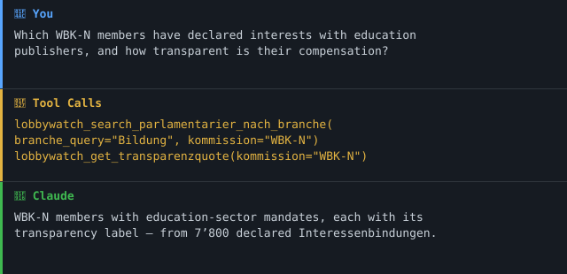

# 🏛️ lobbywatch-mcp

[](https://github.com/malkreide/lobbywatch-mcp/actions/workflows/ci.yml)
[](https://badge.fury.io/py/lobbywatch-mcp)
[](https://www.python.org)
[](LICENSE)
[](https://creativecommons.org/licenses/by-sa/4.0/)
[](https://github.com/malkreide)

> Ein MCP-Server, der KI-Modelle mit **Lobbywatch.ch** verbindet — der grössten öffentlichen Datenbank zu Interessenbindungen im Schweizer Bundesparlament.

[🇬🇧 English version](README.md)

> **Teil des [Swiss Public Data MCP Portfolios](https://github.com/malkreide)** — KI-Modelle an Schweizer Public-Data-Quellen anbinden.

---

## 🎯 Anchor-Demo-Query

> *«Welche Mitglieder der WBK-N haben Interessenbindungen zu Bildungsverlagen oder privaten Bildungsträgern, und wie ist ihre Transparenz-Bewertung?»*

[→ Weitere Anwendungsbeispiele nach Zielgruppe →](EXAMPLES.md)

### Demo



---

## Übersicht

Lobbywatch.ch betreibt die grösste öffentliche Datenbank zu Schweizer Parlamentarier:innen und deren Verbindungen zu Lobbyorganisationen: 245 Parlamentarier:innen, rund 7'800 Interessenbindungen, 139 Lobbygruppen, 368 Zutrittsberechtigte, wöchentlich aktualisiert, lizenziert unter CC BY-SA 4.0.

`lobbywatch-mcp` stellt diese Daten per Model Context Protocol für Large Language Models bereit. Der Server ist komplementär zu [`parlament-mcp`](https://github.com/malkreide/parlament-mcp) (offizielle Curia-Vista-Daten) konzipiert: Die Kombination beantwortet *was* eine Person offiziell tut **und** *mit wem* sie verbunden ist — in derselben Konversation.

## Funktionen

- **Dump-first, API-Fallback.** Der wöchentliche JSON-Export ist die Primärquelle (stabil, live verifiziert); die `dataIF` REST-API wird nur dort genutzt, wo sie zuverlässig liefert (Lobbygruppen, Suche).
- **Sieben Tools in Phase 1** — Profilabfrage, Interessenbindungen, Branchen-Suche, Lobbygruppen, Rankings, Transparenzquote, Cache-Steuerung.
- **CC-BY-SA-4.0-Namensnennung** wird über Pydantic-Envelopes in jeder Antwort automatisch mitgeliefert.
- **Duales Transportprotokoll** — `stdio` für Claude Desktop, `streamable-http` / `sse` für Cloud-Deployments.
- **Unscharfe Namenssuche** (rapidfuzz) für LLM-typische Eingaben wie «Jositsch» oder «Wehrli».
- **Keine Authentifizierung nötig** (Phase 1 — No-Auth-First).

## Architektur

```
                    ┌─────────────────────────────┐
   LLM-Client       │     LobbywatchClient        │
  (Claude Desktop,  │                             │
   Inspector, …)    │   ┌───────────────────┐     │
        │           │   │  Dump-Cache       │     │      cms.lobbywatch.ch
        │  MCP      │   │  (24 h TTL,       │     │      ┌──────────────────┐
        ▼  stdio /  │   │   ~80 MB resident)├─────┼─────►│ wöchentlicher    │
   ┌─────────┐ HTTP │   └───────────────────┘     │      │ JSON-Export      │
   │ FastMCP │◄────►│                             │      │ (~17 MB)         │
   │ Server  │      │   ┌───────────────────┐     │      └──────────────────┘
   └─────────┘      │   │  dataIF REST      ├─────┼─────►┌──────────────────┐
                    │   │  (Live-Fallback)  │     │      │ /interface/v1/   │
                    │   └───────────────────┘     │      │   json/…         │
                    └─────────────────────────────┘      └──────────────────┘
```

Ausgehender HTTP-Verkehr läuft über einen einzigen `httpx.AsyncClient` mit `follow_redirects=False`, einem SSRF-Guard der RFC1918-, Link-local- und Metadata-IPs blockiert, und einem httpx-Event-Hook, der bei jedem Request erneut auflöst. Die Dump-Pfade sind die Primärquelle für Parlamentarier-Abfragen; `dataIF` wird nur für Lobbygruppen-Lookups und das Search-Endpoint verwendet.

## Voraussetzungen

- Python 3.11 oder neuer
- Internetzugang für den wöchentlichen Lobbywatch-JSON-Export (~17 MB gepackt)

## Installation

Via PyPI (nach dem ersten Release):

```bash
pip install lobbywatch-mcp
```

Aus dem Quellcode:

```bash
git clone https://github.com/malkreide/lobbywatch-mcp.git
cd lobbywatch-mcp
pip install -e ".[dev]"
```

## Verwendung

### Standalone

```bash
lobbywatch-mcp
```

Startet den Server im `stdio`-Modus. Für HTTP:

```bash
LOBBYWATCH_MCP_TRANSPORT=http LOBBYWATCH_MCP_PORT=8000 lobbywatch-mcp
```

### Claude Desktop

Eintrag in `claude_desktop_config.json`:

```json
{
  "mcpServers": {
    "lobbywatch": {
      "command": "uvx",
      "args": ["lobbywatch-mcp"]
    }
  }
}
```

Ein vollständiges Beispiel findet sich in [`claude_desktop_config.json`](claude_desktop_config.json).

### Beispielanfragen

Nach dem Verbinden können etwa folgende Prompts verwendet werden:

- *«Zeig mir die Top 10 SP-Mitglieder nach Anzahl Interessenbindungen.»*
- *«Welche WBK-N-Mitglieder haben Mandate im Verlags- oder Bildungssektor?»*
- *«Lade die Lobbygruppe 'economiesuisse' und liste die angebundenen Parlamentarier:innen.»*
- *«Wie ist die Verteilung der Vergütungstransparenz in der Finanzkommission FK-N?»*

## Tools

Alle Tool-Namen tragen seit 0.2.0 das `lobbywatch_`-Namespace-Präfix, um
Kollisionen mit Schwester-Servern im Portfolio zu vermeiden.

| Tool | Zweck | Quelle |
|---|---|---|
| `lobbywatch_get_parlamentarier(name_or_id)` | Vollprofil mit allen Interessenbindungen | Dump |
| `lobbywatch_list_interessenbindungen(name_or_id, nur_hauptberuflich, nur_aktiv)` | Gefilterte Mandatsliste | Dump |
| `lobbywatch_search_parlamentarier_nach_branche(branche_query, kommission, limit)` | Kreuzfilter Branche × Kommission | Dump |
| `lobbywatch_get_lobbygruppe(name_or_id)` | Lobbygruppe inkl. verbundener Organisationen & Parlamentarier:innen | Live dataIF |
| `lobbywatch_get_ranking(kriterium, kommission, partei, limit)` | Top-N nach Kriterium | Dump |
| `lobbywatch_get_transparenzquote(kommission)` | Verteilung der Transparenzbewertungen | Dump |
| `lobbywatch_refresh_dump()` / `lobbywatch_dump_status()` | Cache-Steuerung | Dump |

## Konfiguration

Steuerung vollständig über Umgebungsvariablen:

| Variable | Default | Zweck |
|---|---|---|
| `LOBBYWATCH_MCP_TRANSPORT` | `stdio` | Transportmodus (`stdio`, `http`, `sse`) |
| `LOBBYWATCH_MCP_HOST` | `127.0.0.1` | HTTP-Bind-Host (nur hinter Auth-Gateway auf `0.0.0.0` setzen) |
| `LOBBYWATCH_MCP_PORT` | `8000` | HTTP-Bind-Port |
| `LOBBYWATCH_MCP_CACHE_DIR` | `~/.cache/lobbywatch-mcp` | Speicherort für gecachte Dumps |
| `LOBBYWATCH_MCP_CACHE_TTL` | `86400` (24 h) | Cache-Gültigkeit in Sekunden |
| `LOBBYWATCH_MCP_HTTP_TIMEOUT` | `60` | HTTP-Timeout in Sekunden |
| `LOBBYWATCH_MCP_CORS_ORIGINS` | _(unset)_ | Komma-getrennte Origin-Allow-List für HTTP/SSE; falls gesetzt, wird `Mcp-Session-Id` an Browser exponiert |
| `LOBBYWATCH_MCP_LOG_FORMAT` | `text` | `text` (Standard-Logger) oder `json` (strukturiert via structlog) |
| `LOBBYWATCH_MCP_LOG_LEVEL` | `INFO` | `DEBUG` / `INFO` / `WARNING` / `ERROR` |
| `LOBBYWATCH_MCP_OTEL_ENABLED` | `0` | Auf `1` setzen, um OpenTelemetry-Tracing zu aktivieren (`pip install 'lobbywatch-mcp[obs]'`) |
| `LOBBYWATCH_MCP_OTEL_ENDPOINT` | _(unset)_ | OTLP/HTTP-Collector-Endpoint (z.B. `http://localhost:4318/v1/traces`) |

## Projektstruktur

```
lobbywatch-mcp/
├── src/lobbywatch_mcp/
│   ├── __init__.py
│   ├── __main__.py        # CLI + Transport-Auswahl
│   ├── config.py          # URLs, Cache-Pfade, Attribution
│   ├── client.py          # Dump-Download + dataIF-Client
│   ├── models.py          # Pydantic-v2-Response-Envelopes
│   └── server.py          # FastMCP-Tool-Registrierung
├── tests/
│   ├── conftest.py        # Fixture-Parlamentarier:innen
│   ├── test_client.py     # Respx-Mocked Unit-Tests
│   ├── test_server.py     # Tool-Integrationstests
│   └── test_live.py       # @pytest.mark.live — in CI ausgeschlossen
├── .github/workflows/
│   ├── ci.yml             # Test-Matrix + ruff
│   └── publish.yml        # PyPI OIDC Trusted Publisher
├── claude_desktop_config.json
├── pyproject.toml
└── ...
```

## Datenlizenz & Namensnennung

**Der Code** steht unter MIT-Lizenz.

**Die Daten** sind © Lobbywatch.ch und stehen unter [CC BY-SA 4.0](https://creativecommons.org/licenses/by-sa/4.0/). Jedes Antwort-Envelope trägt automatisch die Attributionszeichenfolge. Weiterverwendende müssen:

1. Lobbywatch.ch als Quelle nennen.
2. Abgeleitete Datensätze unter denselben CC-BY-SA-4.0-Bedingungen teilen.
3. Verstehen, dass Lobbywatch eine **gemeinschaftsgestützte Recherchedatenbank** ist — kein amtliches Register. Für Transparenzforschung autoritativ, aber nicht mit den offiziellen Parlamentsdeklarationen zu verwechseln.

## Bekannte Einschränkungen

- Der Upstream-Endpoint `/table/parlamentarier/...` der `dataIF` liefert aktuell leere Ergebnisse zurück. Der Server umgeht das, indem er den wöchentlichen JSON-Dump verwendet.
- Zutrittsberechtigungen sind im verwendeten «Essential»-Dump nicht enthalten. Ein späteres Release wird sie über den vollständigen Dump ergänzen.

## Beitragen

Siehe [CONTRIBUTING.de.md](CONTRIBUTING.de.md).

## Sicherheit

Siehe [SECURITY.de.md](SECURITY.de.md) für die Sicherheits-Posture, die
akzeptierten Risiken und wie eine Schwachstelle gemeldet wird.

## Changelog

Siehe [CHANGELOG.md](CHANGELOG.md).

## Lizenz

MIT-Lizenz — siehe [LICENSE](LICENSE). Daten CC BY-SA 4.0 — siehe [NOTICE.md](NOTICE.md).

## Autor

**malkreide** · [GitHub](https://github.com/malkreide)

---

*Teil des [Swiss Public Data MCP Portfolios](https://github.com/malkreide).*
